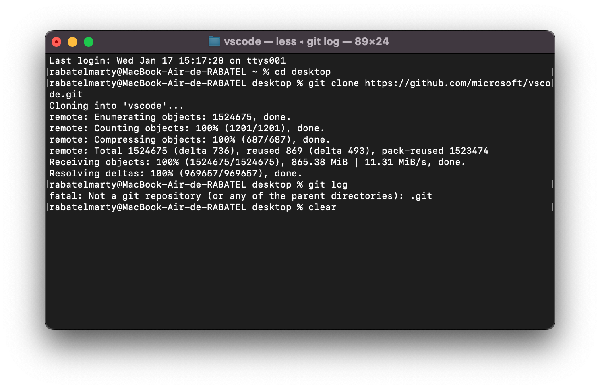
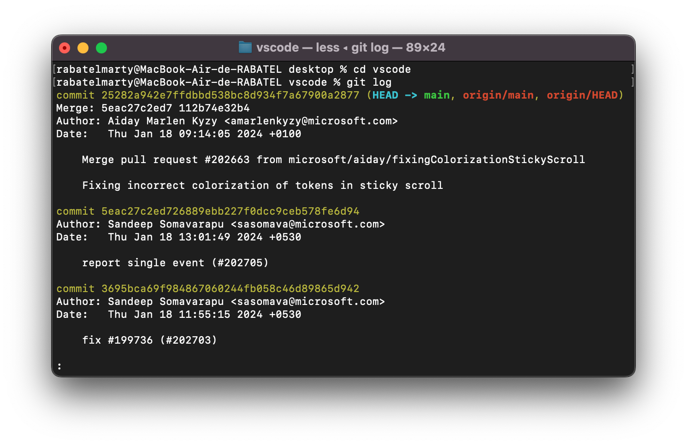
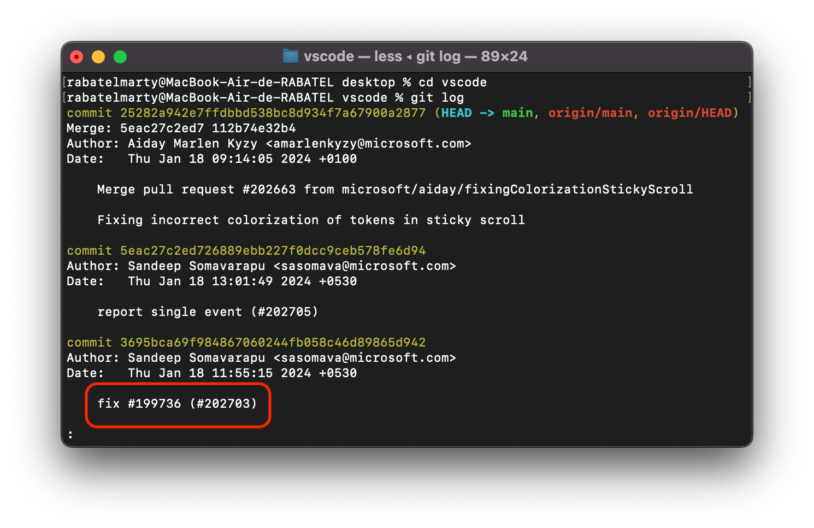
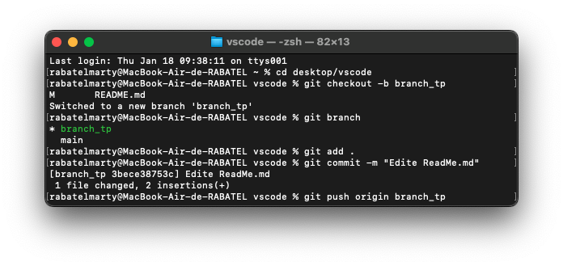

### ISITECH-VERSIONING-Perso

### Réponses 

### TP.1 

1. Clone le depôt git vscode :

2. Examiner l'historique des commit :

2. Type de modification du commit :
    - Ce commit est une correction de bug (fix).

3. Créer une branche puis commit une modification :

### TP.2

1. 