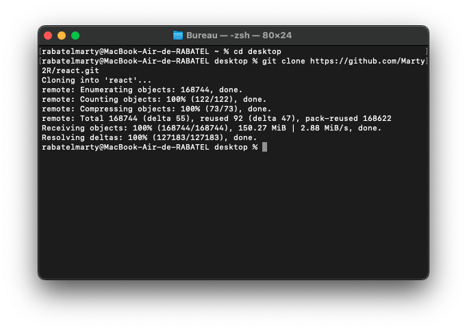
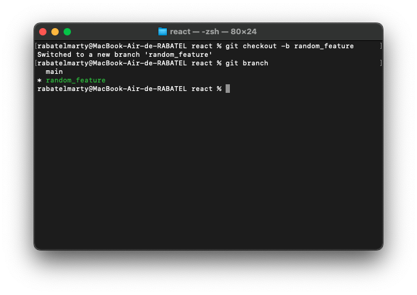
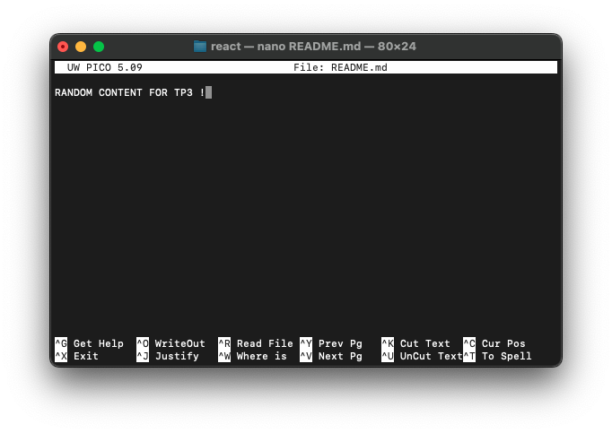
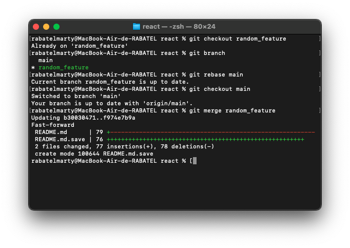
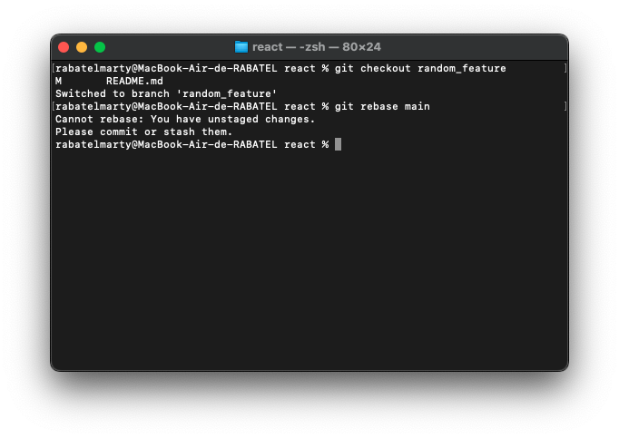

### ISITECH-VERSIONING-Perso

### Réponses 

### TP.1 

1. Clone le depôt git vscode :

2. Examiner l'historique des commit :

2. Type de modification du commit :
    - Ce commit est une correction de bug (fix).

3. Créer une branche puis commit une modification :

### TP.2

1. 

2. 

### TP.3 

1. Créer des branches pour des fonctionnalités hypothétiques,fusionner ces branches.

- Cloner le depôt :

- Créer la branche random_feature :

- Modifier un document (nano README.md) : 

- Add, Commit, Push sur la branche random_feature
- Fusionner la branche random_feature avec la branche main (rebase) :

2. Simuler un conflit de merge et le résoudre.

- 